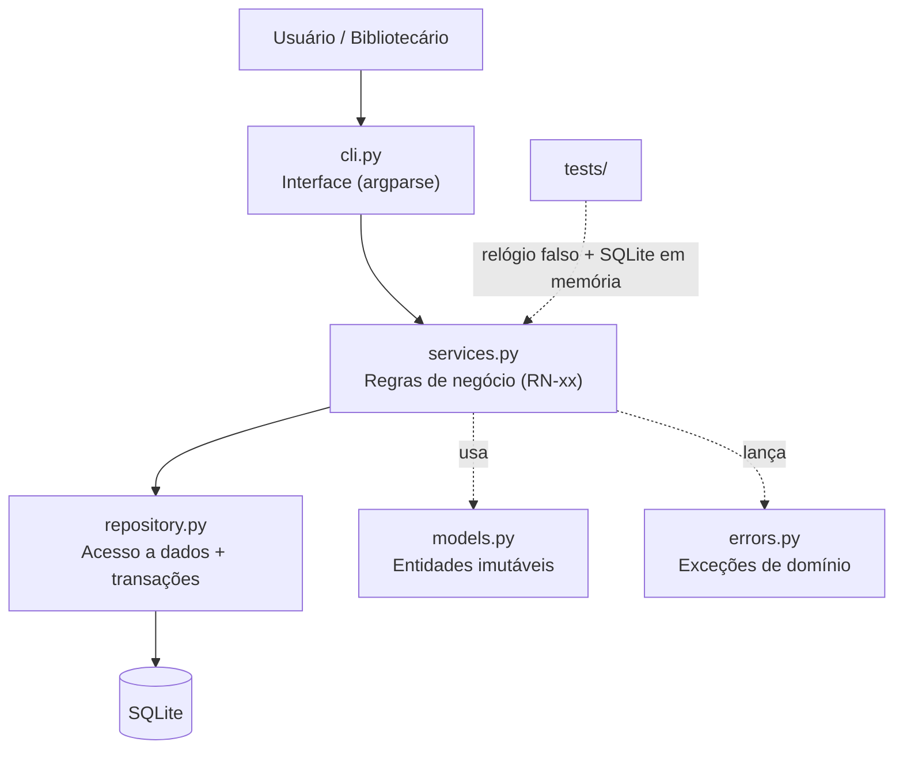
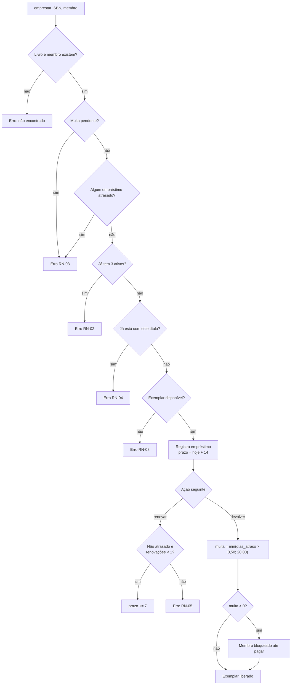

# 📚 BiblioLivre


Sistema de empréstimos para **bibliotecas comunitárias** (escolas, associações de bairro, ONGs) que hoje controlam o acervo em cadernos ou planilhas, perdendo livros e sem controle de prazos.

O BiblioLivre controla acervo, membros, empréstimos, renovações, atrasos e multas pela linha de comando, com banco SQLite local — sem servidor, sem internet, sem dependências externas.

> Projeto desenvolvido com **SDD (Spec-Driven Development)**: a especificação em [`docs/SPEC.md`](docs/SPEC.md) é a fonte da verdade; código e testes referenciam os IDs das regras (RF-xx / RN-xx).

## Sumário
- [Instalação e execução](#instalação-e-execução)
- [Uso](#uso)
- [Testes](#testes)
- [Arquitetura](#arquitetura)
- [Fluxo da aplicação](#fluxo-da-aplicação)
- [Documentação do projeto](#documentação-do-projeto)
- [Equipe](#equipe)

## Instalação e execução

**Requisitos:** Python 3.10+ (nenhuma biblioteca externa) **ou** Docker.

### Opção A — Python local
```bash
git clone https://github.com/<ORG>/<REPO>.git
cd <REPO>
python -m bibliolivre --help
```

### Opção B — Docker (ambiente padronizado)
```bash
docker build -t bibliolivre .
docker run --rm -v "$PWD/dados:/dados" bibliolivre livros
docker build --target test .   # roda os testes dentro do container
```

### Opção B2 — Docker Compose
```bash
docker compose run --rm test          # roda o test harness no container
docker compose run --rm app livros    # usa a aplicação (dados em ./dados)
```

### Opção C — Make
```bash
make test     # roda a suíte
make demo     # executa um cenário de demonstração
```

## Uso

```bash
python -m bibliolivre livro-add 978-85-359-0277-8 "Dom Casmurro" "Machado de Assis" --exemplares 2
python -m bibliolivre membro-add "Ana Souza" ana@email.com
python -m bibliolivre emprestar 9788535902778 1
python -m bibliolivre livros
python -m bibliolivre renovar 1
python -m bibliolivre devolver 1
python -m bibliolivre atrasados
python -m bibliolivre multa 1
python -m bibliolivre pagar 1
python -m bibliolivre membro-anonimizar 1   # LGPD
```

O arquivo do banco é `bibliolivre.db` (altere com `--db caminho` ou variável `BIBLIO_DB`).
Códigos de saída: `0` sucesso, `1` erro de regra/validação, `2` argumento inválido, `3` falha no banco (mensagens em *stderr*, nunca stack trace).

### Regras principais (resumo da SPEC)
| Regra | Descrição |
|---|---|
| RN-01 | Prazo de empréstimo: 14 dias |
| RN-02 | Máximo 3 empréstimos simultâneos por membro |
| RN-03 | Membro com multa pendente **ou** empréstimo atrasado não pode pegar livro |
| RN-04 | Membro não pode ter 2 exemplares do mesmo título |
| RN-05 | 1 renovação (+7 dias), somente se não estiver atrasado |
| RN-06 | Multa de R$ 0,50 por dia de atraso (devolver no dia do prazo não gera multa) |
| RN-07 | Teto de multa: R$ 20,00 por empréstimo |
| RF-09 | Anonimização de membro a pedido do titular (LGPD) |
| RNF-07 | Seguro com dois computadores usando o mesmo arquivo de banco |

## Testes

```bash
python -m unittest discover -s tests -t . -v
./scripts/run_tests.sh      # mesmo comando + salva log em docs/evidencias/
```

### Log da última execução
```
Ran 46 tests in 0.35s

OK
Cobertura de linhas: 100% (mínimo no CI: 95%)
```
Logs completos em [`docs/evidencias/`](docs/evidencias/) e como artefato de cada execução do GitHub Actions.
46 testes em quatro níveis: unidade, integração (CLI e banco real), concorrência (8 conexões simultâneas) e **testes de propriedade** (mais de 2.000 operações aleatórias verificando invariantes). Pipeline do CI: Ruff → testes com cobertura em 3 versões de Python → testes no Docker; CodeQL em paralelo. Resultados e matriz de rastreabilidade em [`docs/TESTES.md`](docs/TESTES.md). A suíte roda automaticamente no GitHub Actions a cada push e Pull Request (Python 3.10–3.12).

## Agentes de IA

O repositório inclui arquivos de instrução para Claude Code (`CLAUDE.md`), Codex CLI (`AGENTS.md`) e Cursor (`.cursorrules`). Todos obrigam o agente a seguir a SPEC, escrever o teste antes do código e respeitar as regras de segurança. Detalhes em [`docs/AGENTES_IA.md`](docs/AGENTES_IA.md).

## Decisões arquiteturais (ADRs — resumo)
| ADR | Decisão | Principal trade-off |
|---|---|---|
| [001](docs/adr/ADR-001-arquitetura-em-camadas.md) | Camadas CLI → Serviço → Repositório | Testabilidade × um pouco mais de código |
| [002](docs/adr/ADR-002-sqlite.md) | SQLite local | Zero instalação × sem multiusuário em rede |
| [003](docs/adr/ADR-003-cli.md) | CLI com argparse | Portabilidade × usabilidade para leigos |
| [004](docs/adr/ADR-004-relogio-injetavel.md) | Relógio injetável | Testes determinísticos × parâmetro extra |
| [005](docs/adr/ADR-005-dinheiro-em-centavos.md) | Dinheiro em centavos inteiros | Exatidão × conversão na exibição |
| [006](docs/adr/ADR-006-transacoes-immediate.md) | Transações `BEGIN IMMEDIATE` | Sem corrida × escritas em fila |
| [007](docs/adr/ADR-007-testes-de-propriedade.md) | Testes de propriedade sem Hypothesis | Zero dependências × sem shrinking |

## Arquitetura

Arquitetura em camadas simples (ver [ADR-001](docs/adr/ADR-001-arquitetura-em-camadas.md)):



| Módulo | Responsabilidade |
|---|---|
| `models.py` | Entidades `Livro`, `Membro`, `Emprestimo` (dataclasses imutáveis) |
| `errors.py` | Hierarquia de exceções de domínio |
| `repository.py` | SQL parametrizado, schema e persistência |
| `services.py` | Todas as regras de negócio; relógio injetável |
| `cli.py` | Parsing de argumentos e formatação de saída |

## Fluxo da aplicação



## Documentação do projeto

| Documento | Conteúdo |
|---|---|
| [`docs/SPEC.md`](docs/SPEC.md) | Especificação técnica (v1.1), contratos de E/S e decomposição em unidades |
| [`docs/AGENTES_IA.md`](docs/AGENTES_IA.md) | Configuração dos agentes (`CLAUDE.md`, `AGENTS.md`, `.cursorrules`) |
| [`docs/adr/`](docs/adr/) | Registros de Decisão de Arquitetura (ADR-001 a ADR-005) |
| [`docs/TESTES.md`](docs/TESTES.md) | Resultado dos testes e rastreabilidade SPEC → teste |
| [`docs/ERROS_E_RE_ESPECIFICACAO.md`](docs/ERROS_E_RE_ESPECIFICACAO.md) | Erros lógicos encontrados e loop de re-especificação |
| [`docs/GOVERNANCA.md`](docs/GOVERNANCA.md) | Branches, PRs, code review, sprints e issues |
| [`docs/RELATORIO_IA.md`](docs/RELATORIO_IA.md) | Análise comparativa de ferramentas de IA + ética e segurança |
| [`docs/RELATO_EXPERIENCIA.md`](docs/RELATO_EXPERIENCIA.md) | Aprendizados e desafios do grupo |
| [`CONTRIBUTING.md`](CONTRIBUTING.md) | Como contribuir |
| [`SECURITY.md`](SECURITY.md) | Política e medidas de segurança |
| [`CHANGELOG.md`](CHANGELOG.md) | Histórico de versões |
| [`docs/ROTEIRO_APRESENTACAO.md`](docs/ROTEIRO_APRESENTACAO.md) | Roteiro da apresentação/vídeo e perguntas prováveis |

## Equipe

| Nome | GitHub | Papel principal |
|---|---|---|
| [PREENCHER] | @ | Tech lead / revisão |
| [PREENCHER] | @ | Regras de negócio (services) |
| [PREENCHER] | @ | Persistência e CLI |
| [PREENCHER] | @ | Testes, CI e documentação |

## Licença
MIT — ver [`LICENSE`](LICENSE).
