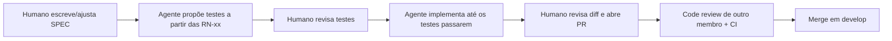

# Configuração e Uso de Agentes de IA no Fluxo SDD

## Ferramentas configuradas
| Ferramenta | Arquivo de contexto no repo | Status |
|---|---|---|
| Claude Code | `CLAUDE.md` | configurado |
| Codex CLI | `AGENTS.md` | configurado |
| Cursor | `.cursorrules` + `.cursorignore` | configurado |
| Antigravity | usa `AGENTS.md` / regras do workspace | opcional |

Todos os arquivos têm o mesmo conteúdo essencial: **SPEC como fonte da verdade**, ordem teste → código, restrições de arquitetura e de segurança.

## Como o agente entra no fluxo SDD


## Instalação e uso
### Claude Code
```bash
npm install -g @anthropic-ai/claude-code
cd bibliolivre && claude
```
Prompt-padrão usado:
> Leia docs/SPEC.md e CLAUDE.md. Implemente a issue #N (regra RN-xx). Escreva primeiro o teste em tests/, rode a suíte, depois implemente. Não altere a SPEC; se achar ambiguidade, me pergunte.

### Codex CLI
```bash
npm install -g @openai/codex
cd bibliolivre && codex
```
Mesmo prompt; o Codex lê `AGENTS.md` automaticamente.

### Cursor
Abrir a pasta do projeto; `.cursorrules` é carregado automaticamente. Usar `@docs/SPEC.md` no chat para anexar a especificação.

> Confirmem os comandos de instalação na documentação oficial de cada ferramenta. Eles mudam com frequência.

## Registro de uso (preencher durante o projeto)
| Data | Membro | Ferramenta | Tarefa / issue | Prompt resumido | Resultado | Correções humanas necessárias |
|---|---|---|---|---|---|---|
| [PREENCHER] | | | | | | |
