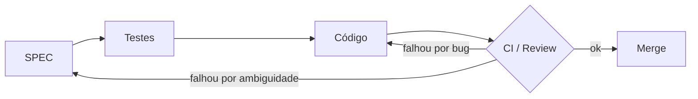

# Erros Lógicos e Loop de Re-especificação

> Cada item referencia a issue e o PR em que foi tratado. Substituam os `#[PREENCHER]` pelos números reais e ajustem a descrição ao que de fato aconteceu com o grupo.

## Processo adotado
1. Teste falha (local ou no CI) **ou** revisor aponta problema no code review.
2. Abre-se uma issue com rótulo `bug` (erro de implementação) ou `spec` (a especificação estava ambígua/errada).
3. Se for `spec`: a equipe discute, atualiza `docs/SPEC.md` primeiro, depois o teste, depois o código (ordem SDD).
4. PR de correção inclui um teste de regressão que falhava antes da correção.

## Parte A — Erros lógicos identificados

### ERR-01 — Off-by-one na multa
- **Sintoma:** devolver no próprio dia do vencimento cobrava R$ 0,50.
- **Causa:** o cálculo usava `(devolucao - prevista).days + 1`, contando o dia do prazo como atraso.
- **Detecção:** `test_devolucao_no_dia_do_prazo_sem_multa` e o caso `0: 0` de `test_calculo_multa_limites`.
- **Correção:** `max(0, (devolucao - prevista).days)`. Também evita multa negativa em devolução antecipada (caso `-3`).
- **Issue/PR:** #[PREENCHER] / #[PREENCHER]

### ERR-02 — Imprecisão com `float` em valores monetários
- **Sintoma:** somatório de multas de vários empréstimos exibia `R$ 1,4999999`.
- **Causa:** `0.5` e somas acumuladas em ponto flutuante binário.
- **Correção:** tudo em centavos inteiros (ADR-005, RNF-03).
- **Issue/PR:** #[PREENCHER] / #[PREENCHER]

### ERR-03 — Devolução duplicada zerava o estado
- **Sintoma:** chamar `devolver` duas vezes sobrescrevia a data de devolução e recalculava a multa (podendo aumentá-la) e liberava o exemplar em duplicidade na contagem.
- **Correção:** verificação `if not emp.ativo` antes de registrar; teste `test_devolucao_duplicada`.
- **Issue/PR:** #[PREENCHER] / #[PREENCHER]

### ERR-04 — `True` aceito como quantidade de exemplares
- **Sintoma:** `cadastrar_livro(..., exemplares=True)` gravava 1 exemplar.
- **Causa:** em Python `bool` é subclasse de `int`; `isinstance(True, int)` é `True`.
- **Correção:** rejeitar `bool` explicitamente; caso incluído em `test_exemplares_invalidos`.
- **Issue/PR:** #[PREENCHER] / #[PREENCHER]

### ERR-05 — E-mail duplicado com maiúsculas
- **Sintoma:** `Ana@x.com` e `ana@x.com` viravam dois membros.
- **Correção:** normalizar para minúsculas antes de validar e gravar; `test_email_duplicado_case_insensitive`.
- **Issue/PR:** #[PREENCHER] / #[PREENCHER]

### ERR-06 — Condição de corrida no último exemplar
- **Sintoma:** com duas instâncias abertas no mesmo arquivo de banco, ambas conseguiam emprestar o único exemplar disponível → disponibilidade −1.
- **Causa:** no modo padrão do `sqlite3`, a leitura de validação acontecia fora de transação; o lock só era obtido no `INSERT`.
- **Detecção:** revisão de código (pergunta "e se dois voluntários usarem ao mesmo tempo?"), depois confirmada pelo teste com 8 threads.
- **Correção:** `BEGIN IMMEDIATE` envolvendo validação + gravação (ADR-006).
- **Issue/PR:** #[PREENCHER] / #[PREENCHER]

### ERR-07 — Banco corrompido mostrava stack trace
- **Sintoma:** `python -m bibliolivre livros` com arquivo `.db` inválido exibia `Traceback ... sqlite3.DatabaseError`.
- **Causa:** o `Repositorio` era criado **antes** do bloco `try` da CLI, então a exceção escapava do tratamento. Violava RNF-06 e expunha detalhes internos.
- **Detecção:** o teste `test_banco_corrompido_nao_expoe_stack_trace` falhou na primeira execução.
- **Correção:** abertura do banco movida para dentro do `try` e captura de `sqlite3.Error` com código de saída 3.
- **Issue/PR:** #[PREENCHER] / #[PREENCHER]

## Parte B — Re-especificações (a SPEC mudou)

### RE-01 — Renovação no dia do vencimento
- **v1.0 dizia:** "renovação permitida antes do vencimento".
- **Problema:** ambíguo. "Antes" inclui o próprio dia? Implementação e teste divergiram (um usava `<`, outro `<=`).
- **v1.1:** permitido até o dia do vencimento, inclusive; proibido se já atrasado. Teste `test_renovar_no_ultimo_dia_permitido`.

### RE-02 — Teto de multa
- **v1.0:** multa ilimitada.
- **Problema:** no teste de 365 dias de atraso a multa chegava a R$ 182,50 — maior que o preço do livro. Feedback da equipe: isso afastaria justamente o público que a biblioteca quer atender.
- **v1.1:** teto de R$ 20,00 por empréstimo (RN-07). Casos 40/41/365 em `test_calculo_multa_limites`.

### RE-03 — Bloqueio por atraso ainda não devolvido
- **v1.0:** bloqueava apenas quem tinha *multa pendente*.
- **Problema revelado por teste:** a multa só é gerada na devolução. Logo, um membro com livro 30 dias atrasado **não devolvido** continuava pegando outros livros. Brecha de regra, não bug de código.
- **v1.1:** RN-03 passa a bloquear também empréstimo ativo em atraso. Teste `test_bloqueio_por_atraso_ativo`.

### RE-04 — Unidade monetária explícita na SPEC
- **v1.0:** "multa de R$ 0,50 por dia" sem especificar representação.
- **v1.1:** RNF-03 exige centavos inteiros, consequência de ERR-02.

### RE-05 — Requisitos vindos da análise ética (LGPD e concorrência)
- **v1.1:** não previa exclusão de dados pessoais nem uso simultâneo.
- **Gatilho:** ao escrever o relatório técnico-ético, a equipe percebeu que o sistema guarda nome e e-mail (dados pessoais pela LGPD) sem permitir que o titular peça a eliminação. A revisão de ERR-06 mostrou que "um único usuário" não era uma premissa escrita na SPEC.
- **v1.2:** RF-09 (anonimização, preservando o histórico para estatística) e RNF-07 (atomicidade). Mostra o loop completo do SDD: **a discussão ética alterou a especificação**, que alterou os testes, que alteraram o código.
