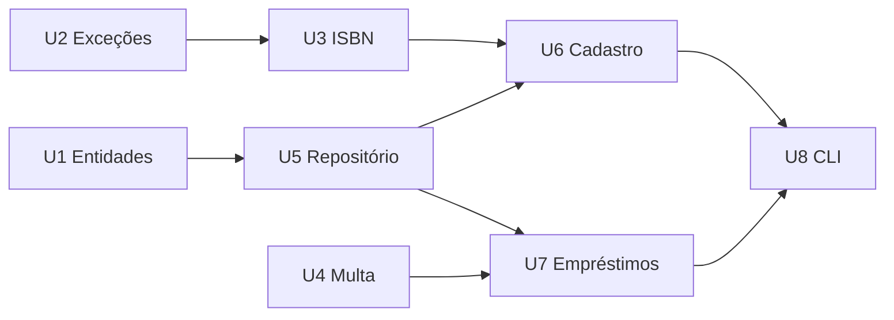

# Especificação Técnica — BiblioLivre (v1.2)

## Histórico de versões
| Versão | Entrega | Mudanças |
|---|---|---|
| v0.1 | E1 (rascunho) | Problema, escopo, RF-01..RF-08, RN-01..RN-06 |
| v1.0 | E1 (final) | Após revisão do grupo: adicionada RN-04 (mesmo título), RN-08 (disponibilidade); ISBN passa a exigir dígito verificador; contratos de E/S (seção 5) |
| v1.1 | E2 | Loop de re-especificação RE-01..RE-04 (ver `ERROS_E_RE_ESPECIFICACAO.md`) |
| v1.2 | E2 | RE-05: RF-09 (LGPD) e RNF-07 (atomicidade/concorrência) |

> Histórico: v1.0 (Entrega 1) → v1.1 (esta entrega, após o loop de re-especificação descrito em `ERROS_E_RE_ESPECIFICACAO.md`). Alterações da v1.1 marcadas com **[RE-xx]**.

## 1. Problema
Bibliotecas comunitárias controlam empréstimos em papel. Consequências: livros não devolvidos, ninguém sabe quais estão atrasados, cobrança de multa inconsistente. Público: voluntários sem formação técnica, computadores modestos e muitas vezes sem internet.

## 2. Escopo
Dentro: acervo, membros, empréstimo, devolução, renovação, atrasos, multas.
Fora (backlog futuro): reservas, interface web, notificações por e-mail, múltiplas bibliotecas, autenticação de usuários.

## 3. Requisitos funcionais
| ID | Requisito | Critério de aceitação |
|---|---|---|
| RF-01 | Cadastrar livro (ISBN-13, título, autor, nº de exemplares) | ISBN aceita hífens/espaços, valida dígito verificador; título/autor não vazios; exemplares inteiro ≥ 1; ISBN único |
| RF-02 | Cadastrar membro (nome, e-mail) | E-mail normalizado em minúsculas, formato válido, único |
| RF-03 | Registrar empréstimo | Respeita RN-01 a RN-04 e RN-08 |
| RF-04 | Registrar devolução | Calcula multa (RN-06, RN-07); não permite devolver duas vezes |
| RF-05 | Renovar empréstimo | Respeita RN-05 |
| RF-06 | Listar atrasados | Empréstimos ativos com prazo < hoje |
| RF-07 | Consultar e quitar multas | Valor exibido em reais (R$ x,yy) |
| RF-08 | Listar acervo com disponibilidade | disponíveis = exemplares − empréstimos ativos |
| RF-09 | **Anonimizar membro (LGPD) [RE-05]** | Remove nome e e-mail; mantém histórico; bloqueado se houver empréstimo ativo ou multa pendente; e-mail original fica livre |

## 4. Regras de negócio
| ID | Regra |
|---|---|
| RN-01 | Prazo de 14 dias corridos a partir da data do empréstimo |
| RN-02 | Máximo de 3 empréstimos ativos por membro |
| RN-03 | Bloqueia novo empréstimo se houver multa pendente **ou empréstimo ativo em atraso [RE-03]** |
| RN-04 | Membro não pode ter dois exemplares do mesmo ISBN ao mesmo tempo |
| RN-05 | 1 renovação por empréstimo, +7 dias contados do prazo atual; **proibida se já atrasado; permitida no próprio dia do vencimento [RE-01]** |
| RN-06 | Multa de R$ 0,50 por dia de atraso; **devolução no dia do prazo = 0 dias de atraso [ERR-01]** |
| RN-07 | **Teto de R$ 20,00 de multa por empréstimo [RE-02]** |
| RN-08 | Não empresta se não houver exemplar disponível |

## 5. Contratos de entrada/saída

### 5.1 Camada de serviço (`Biblioteca`) — API interna
| Operação | Entrada | Saída (sucesso) | Erros |
|---|---|---|---|
| `cadastrar_livro(isbn, titulo, autor, exemplares=1)` | `str, str, str, int` | `Livro` | `ValidacaoError`, `RegraNegocioError` (duplicado) |
| `cadastrar_membro(nome, email)` | `str, str` | `Membro` (id gerado) | `ValidacaoError`, `RegraNegocioError` (e-mail já existe) |
| `emprestar(isbn, membro_id)` | `str, int` | `Emprestimo` (prevista = hoje + 14) | `NaoEncontradoError`, `RegraNegocioError` (RN-02/03/04/08) |
| `devolver(emprestimo_id)` | `int` | `Emprestimo` com `data_devolucao` e `multa_centavos` | `NaoEncontradoError`, `RegraNegocioError` (já devolvido) |
| `renovar(emprestimo_id)` | `int` | `Emprestimo` (prevista + 7, renovacoes + 1) | `NaoEncontradoError`, `RegraNegocioError` (RN-05) |
| `atrasados()` | — | `List[Emprestimo]` ordenada por prazo | — |
| `multa_pendente(membro_id)` | `int` | `int` (centavos) | `NaoEncontradoError` |
| `pagar_multas(membro_id)` | `int` | `int` (centavos quitados) | `NaoEncontradoError` |
| `disponiveis(isbn)` | `str` | `int` | `ValidacaoError`, `NaoEncontradoError` |
| `anonimizar_membro(membro_id)` | `int` | `Membro` anonimizado | `NaoEncontradoError`, `RegraNegocioError` (pendências) |
| `calcular_multa(prevista, devolucao)` | `date, date` | `int` (centavos, 0..2000) | — (função pura) |

### 5.2 Linha de comando — contrato externo
| Comando | Saída padrão (exit 0) | Falha (exit 1, stderr) |
|---|---|---|
| `livro-add ISBN TITULO AUTOR [--exemplares N]` | `Livro cadastrado: <titulo> (<isbn>) x<N>` | `Erro: <mensagem>` |
| `membro-add NOME EMAIL` | `Membro #<id> cadastrado: <nome>` | idem |
| `emprestar ISBN MEMBRO_ID` | `Empréstimo #<id> registrado. Devolver até DD/MM/AAAA` | idem |
| `devolver EMP_ID` | `Empréstimo #<id> devolvido.[ Multa: R$ x,yy]` | idem |
| `renovar EMP_ID` | `Empréstimo #<id> renovado até DD/MM/AAAA` | idem |
| `livros` | uma linha por livro: `isbn \| titulo \| autor \| disponíveis: d/t` | — |
| `atrasados` | uma linha por atraso ou `Nenhum empréstimo em atraso.` | — |
| `multa MEMBRO_ID` / `pagar MEMBRO_ID` | `Multa pendente: R$ x,yy` / `Pago: R$ x,yy` | idem |
| `membro-anonimizar MEMBRO_ID` | `Dados pessoais removidos: Membro anonimizado #<id>` | idem |

Argumentos com tipo errado (ex.: texto no lugar de ID) → exit 2 (padrão do argparse). Falha no banco de dados → exit 3 com `Erro: falha ao acessar o banco de dados`.

## 6. Decomposição em unidades
Cada unidade pode ser desenvolvida e testada isoladamente (uma issue/branch por unidade):

| Unidade | Arquivo | Depende de | Testável com |
|---|---|---|---|
| U1 Entidades | `models.py` | — | — (dados puros) |
| U2 Exceções | `errors.py` | — | — |
| U3 Validação de ISBN | `services.normalizar_isbn` | U2 | testes puros |
| U4 Cálculo de multa | `Biblioteca.calcular_multa` | — | testes puros (sem banco) |
| U5 Repositório | `repository.py` | U1 | SQLite `:memory:` |
| U6 Cadastro | `services` (cadastrar_*) | U3, U5 | SQLite `:memory:` |
| U7 Empréstimo/devolução/renovação | `services` | U4, U5, relógio | SQLite `:memory:` + `Relogio` falso |
| U8 CLI | `cli.py` | U6, U7 | arquivo SQLite temporário |

## 7. Requisitos não funcionais
| ID | Requisito |
|---|---|
| RNF-01 | Sem dependências externas; Python ≥ 3.10 |
| RNF-02 | Funciona offline, dados em arquivo local (SQLite) |
| RNF-03 | Valores monetários em centavos inteiros (sem `float`) **[RE-04]** |
| RNF-04 | Consultas SQL sempre parametrizadas |
| RNF-05 | Toda regra RN-xx coberta por ao menos um teste automatizado |
| RNF-06 | Mensagens de erro em português, sem stack trace para o usuário |
| RNF-07 | **Operações de escrita atômicas e seguras com acesso simultâneo ao mesmo arquivo [RE-05]** |
| RNF-08 | Cobertura de testes ≥ 95% das linhas, verificada no CI |
